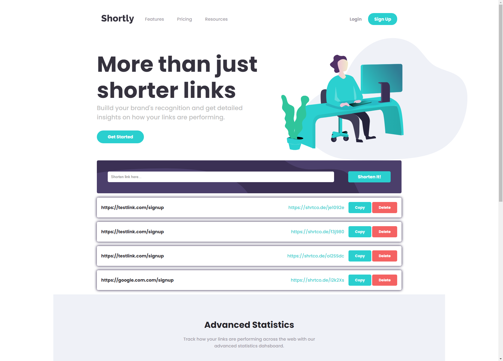
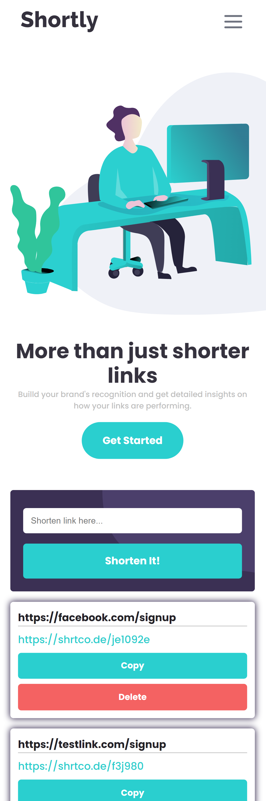

# Frontend Mentor - Shortly URL shortening API Challenge solution

This is a solution to the [Shortly URL shortening API Challenge challenge on Frontend Mentor](https://www.frontendmentor.io/challenges/url-shortening-api-landing-page-2ce3ob-G). Frontend Mentor challenges help you improve your coding skills by building realistic projects. 

## Navigating Potential Challenges
During the development of this web application, I encountered a notable consideration that warrants attention. Depending on your Internet Service Provider (ISP), there might be instances where the API could be inaccessible due to potential blocking. To ensure a seamless experience, I advise considering the utilization of a Virtual Private Network (VPN) while engaging with this web app, especially if you encounter any functionality issues.

By employing a VPN, you can potentially circumvent any ISP-related obstacles and enhance your ability to interact with the application. This proactive strategy highlights a commitment to providing users with a dependable and consistent experience, regardless of potential challenges from different ISPs.


## Table of contents

- [Overview](#overview)
  - [The challenge](#the-challenge)
  - [Screenshot](#screenshot)
  - [Links](#links)
- [My process](#my-process)
  - [Built with](#built-with)
  - [What I learned](#what-i-learned)
  - [Continued development](#continued-development)
  - [Useful resources](#useful-resources)
- [Author](#author)


## Overview

### The challenge

Users should be able to:

- View the optimal layout for the site depending on their device's screen size ✔️
- Shorten any valid URL ✔️
- See a list of their shortened links, even after refreshing the browser ✔️
- Copy the shortened link to their clipboard in a single click ✔️
- Receive an error message when the `form` is submitted if:
  - The `input` field is empty ✔️
- **Bonus**: Be able to Delete shortened links ✔️

### Screenshot

- Desktop Screenshot
<p float="left">
  
</p>

- Mobile Screenshots
<p>
  
</p>

### Links

- Solution URL: [Add solution URL here](https://your-solution-url.com)
- Live Site URL: [Add live site URL here](https://your-live-site-url.com)

## My process

### Built with

- Semantic HTML5 markup
- CSS custom properties
- Flexbox
- Mobile-first workflow
- [React](https://reactjs.org/) - JS library

### What I learned

Through this project, I delved into the realm of API coding, immersing myself in the intricacies of asynchronous programming using async and await. I successfully harnessed the power of the shrtcode.de API to efficiently shorten URLs. Additionally, I acquired the skill of seamlessly copying these shortened links to the clipboard.

For a visual representation of the implementation, refer to the following code snippets:

**URL Shortening with Async and Await**

Utilizing the capabilities of async and await, I seamlessly integrated the fetch function to interact with the shrtco.de API and create shortened URLs.

```js
  // Shortens link
  const handleShortenLink = async () => {
    try {
      const response = await fetch(
        `https://api.shrtco.de/v2/shorten?url=${linkValue}`
      );
      const data = await response.json();

      if (data.ok) {
        const newShortLink = data.result.full_short_link;
        setShortURL(newShortLink);
        setSavedLinks([
          ...savedLinks,
          {
            id: crypto.randomUUID(),
            text: linkValue,
            newShortLink,
          },
        ]);
      } else {
        setShortURL("");
      }
    } catch (error) {
      console.error("Ann error has occured", error);
      setShortURL("");
    }
  };
```

**Copying Shortened Links to Clipboard**

I implemented the functionality to effortlessly copy the shortened links to the clipboard, providing a user-friendly experience.

```js
  const copyToClipboard = (newShortLink) => {
    navigator.clipboard.writeText(newShortLink);
    setCopyClicked(true);

    setTimeout(() => {
      setCopyClicked(false);
    }, 500);
  };
```

These advancements in my project showcase my adeptness in working with asynchronous operations, API integration, and enhancing user interaction.

### Continued development

Moving forward in the development process, my focus will extend to learning and crafting a multi-page web application. This journey will involve delving deeper into the intricacies of React and uncovering the hidden gems of JavaScript.

### Useful resources

- [CHECK TO LEARN](https://www.youtube.com/watch?v=4Pil9Ozvv1M&t=1s&ab_channel=CHECKTOLEARN) - This helped me learn how to copy to clipboard.

## Author

- Website - [Ioan Gheraszim](https://github.com/ioangheraszim)
- Frontend Mentor - [@ioangheraszim](https://www.frontendmentor.io/profile/ioangheraszim)
